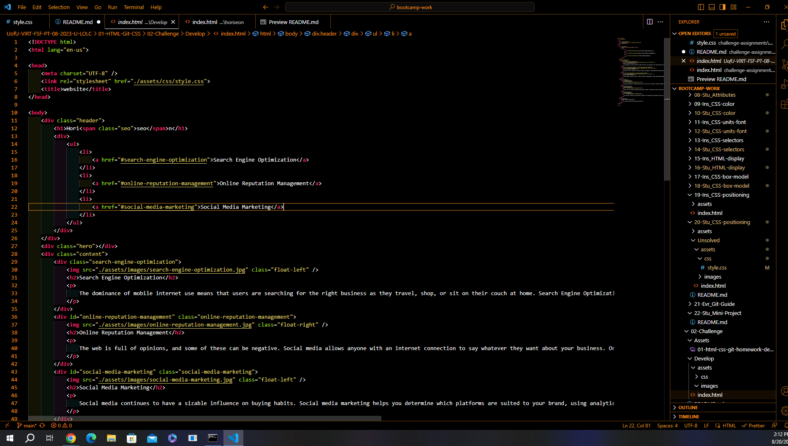
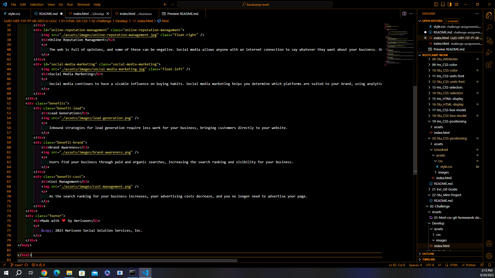
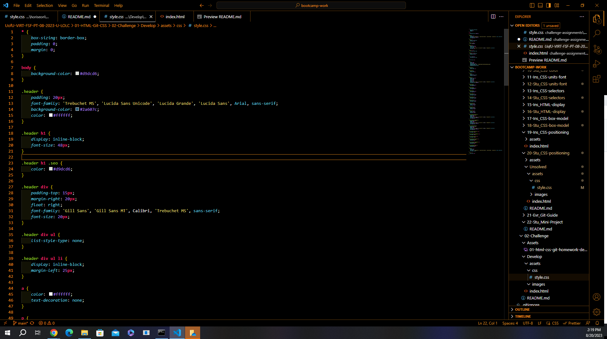
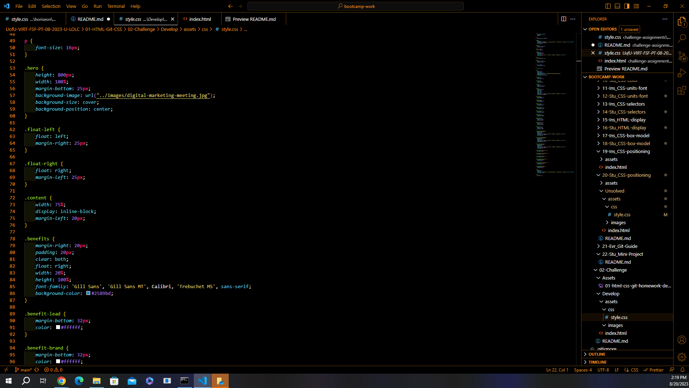
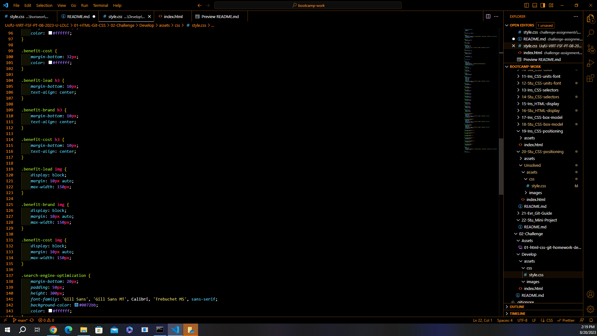
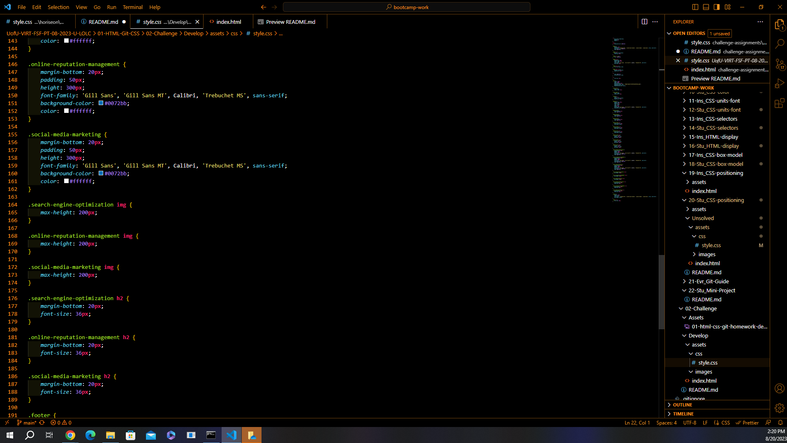
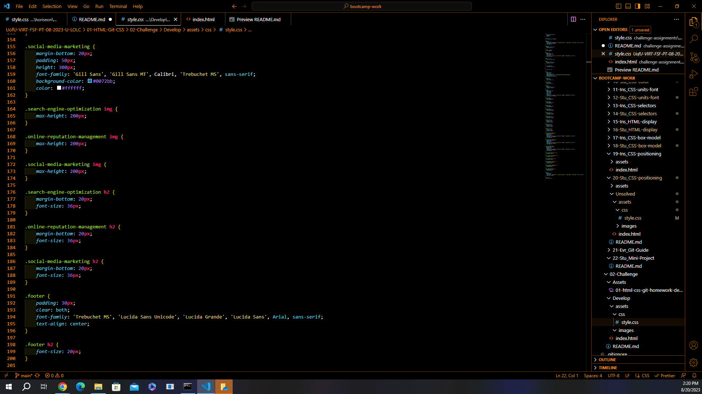

# Horiseon

## Desciption

This project was designed to test and apply my skills with HTML and CSS. And use my new skills to edit code to make it more convenient and understandable for anyone who may look at it.

## Usage

To use this project and understand it's purpose you have to look at the code. It is designed as something that needed to be simplified yet still match the final outcome. Shown below are images that depict the starting code followed by an image that shows the desired output of the project.

